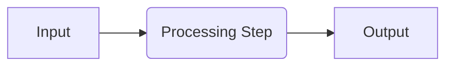

# Template di Riferimento per Feature Planning

Questo documento contiene i template standard per le spec di feature (requirements, design, tasks) e il formato compatto per `.pi/plans/`.

---

# 1. `specs/<feature-name>/requirements.md`

```markdown
---
status: DESIGNED
created_date: {{DATE}}
updated_date: {{DATE}}
author: {{AUTHOR}}
tags: [spec, requirements]
---

# Requirements — {{FEATURE_NAME}}

## User Story
As a **{{ROLE}}**, I want to **{{ACTION}}** so that **{{BENEFIT}}**.

## Context & Existing Patterns

### Relevant Precedents
1. **[[Precedent 1]]** — `{{FILE_PATH_1}}`, symbol(s): `{{SYMBOLS_1}}`
   - What it does well: {{SUMMARY}}
   - What to avoid: {{CAVEATS}}
2. **[[Precedent 2]]** — `{{FILE_PATH_2}}`, symbol(s): `{{SYMBOLS_2}}`
   - What it does well: {{SUMMARY}}
   - What to avoid: {{CAVEATS}}

> If fewer than two precedents exist, document the justification below and proceed.
- **Justification for fewer precedents**: {{JUSTIFICATION}}

### Related Files & Symbols
| File | Symbol / Class | Role in This Feature |
| ---- | -------------- | -------------------- |
| `{{PATH}}` | `{{SYMBOL}}` | {{ROLE}} |

## Acceptance Criteria (EARS Format)

Each criterion is testable and traceable. Use EARS syntax keywords: `WHEN`, `THE`, `SHALL`, `SHALL NOT`, `IF`.

### AC-1: {{CRITERION_TITLE}}
- **Description**: WHEN <precondition>, THE system SHALL <response>.
- **Traceability**: Validates requirement REQ-{{N}}
- **Test Scenario**: {{TEST_DESCRIPTION}}
  - Given: {{GIVEN_CONTEXT}}
  - When: {{ACTION}}
  - Then: {{EXPECTED_OUTCOME}}

### AC-2: {{CRITERION_TITLE}}
- **Description**: WHEN <precondition>, THE system SHALL <response>.
- **Traceability**: Validates requirement REQ-{{N}}
- **Test Scenario**: {{TEST_DESCRIPTION}}

## Correctness Properties

Properties that must hold true after implementation. Based on examples or property-based testing where applicable.

| Property ID | Description | Type | Linked Requirements |
| ----------- | ----------- | ---- | ------------------- |
| PROP-1 | {{PROPERTY_DESC}} | {{INVARIANT / EXAMPLE }} | REQ-{{N}}, REQ-{{M}} |

## Out of Scope for This Feature
- {{ITEM_1}}
- {{ITEM_2}}

## Risks & Mitigations
| Risk | Likelihood (H/M/L) | Impact (H/M/L) | Mitigation |
| ---- | ------------------ | -------------- | ---------- |
| {{RISK}} | {{LIKELIHOOD}} | {{IMPACT}} | {{MITIGATION}} |
```

---

# 2. `specs/<feature-name>/design.md`

```markdown
---
status: DESIGNED
created_date: {{DATE}}
updated_date: {{DATE}}
author: {{AUTHOR}}
tags: [spec, design]
---

# Design — {{FEATURE_NAME}}

## Overview
{{HIGH_LEVEL_DESCRIPTION}}

## Architectural Decisions

### Decision 1: {{DECISION_TITLE}}
- **Context**: Why this decision is needed.
- **Options Considered**:
  1. Option A — pros/cons
  2. Option B — pros/cons
- **Chosen Approach**: {{CHOSEN_OPTION}}
- **Justification**: {{REASONING}}
- **Linked Requirements**: REQ-{{N}}, PROP-{{M}}
- **Precedent Referenced**: `{{FILE_PATH}}`, symbol(s): `{{SYMBOLS}}`

## Data Flow


> **Mermaid safety notes**: Never use `<br/>` or HTML tags inside node labels. Use `\n` for line breaks (e.g., `[Node A\nLine 2]`) or split into separate nodes. Quote any label containing `{}`, `[]`, or `<>`. See SKILL.md Mermaid Diagram Safety Rules for full guidance.

> If mermaid is not supported in the target viewer, provide a text-based flow description:
1. Input → Processing Step 1 → Output
2. Processing Step 1 → Error Handling → Log

## File & Class Changes
| Action | Path | Module / Symbol Affected | Rationale |
| ------ | ---- | ------------------------ | --------- |
| MODIFY | `{{PATH}}` | {{CLASS/SYMBOL}} | {{REASON}} |
| ADD | `{{PATH}}` | {{NEW_SYMBOL}} | {{REASON}} |
| DELETE | `{{PATH}}` | {{DELETED_SYMBOL}} | {{REASON}} |

## Test Strategy
| Requirement | Property/Scenario | Target File(s) | Method |
| ----------- | ----------------- | -------------- | ------ |
| REQ-1 | SCENARIO-X | tests/test_{{MODULE}}.py | unit / integration |
| PROP-2 | PROPERTY-Y | tests/test_{{PROPERTY}}.py | property-based |

## Risks & Mitigations (Design-Level)
| Risk | Likelihood | Impact | Mitigation |
| ---- | ---------- | ------ | ---------- |
| {{RISK}} | H/M/L | H/M/L | {{MITIGATION}} |
```

---

# 3. `specs/<feature-name>/tasks.md`

Each task is atomic with clear entry/exit criteria and traceability to requirements/tests.

```markdown
---
status: DESIGNED
created_date: {{DATE}}
updated_date: {{DATE}}
author: {{AUTHOR}}
tags: [spec, tasks]
---

# Tasks — {{FEATURE_NAME}}

## Task Checklist

All tasks are atomic. Update `[ ]` to `[x]` after completion. Each task links back to its validating requirement(s).

### Phase 1: Preparation
- [ ] **TASK-001**: Setup scaffolding (create directories, files)
  - Requirements: REQ-{{N}}
  - Tests: TEST-{{M}}
  - Description: {{DESCRIPTION}}

### Phase 2: Implementation
- [ ] **TASK-002**: Implement core logic for {{SUBCOMPONENT}}
  - Requirements: REQ-{{N}}, REQ-{{M}}
  - Properties: PROP-{{K}}
  - Precedents: `{{FILE_PATH}}`, symbol(s): `{{SYMBOLS}}`
  - Tests: `tests/test_{{MODULE}}.py` — scenario {{SCENARIO}}
  - Description: {{DESCRIPTION}}

### Phase 3: Verification
- [ ] **TASK-003**: Write unit tests for {{SUBCOMPONENT}}
  - Requirements: REQ-{{N}}
  - Tests: `tests/test_{{MODULE}}.py`
  - Description: {{DESCRIPTION}}

## Implementation Log
> Record deviations, new patterns discovered, and ADRs created during implementation.

| Date | Task | Deviation / Note |
| ---- | ---- | ---------------- |
| {{DATE}} | TASK-XXX | {{NOTE}} |
```

---

# 4. Compact Plan (`.pi/plans/<feature-name>.md`)

Use this template **only** for features touching ≤3 files, without introducing new modules or requiring cross-component decisions.

```markdown
---
status: PLAN_READY
created_date: {{DATE}}
updated_date: {{DATE}}
tags: [plan, compact]
---

# Compact Plan — {{FEATURE_NAME}}

> This feature is small enough to be documented in a single file. If the scope grows beyond 3 files or introduces new modules, migrate to `specs/<feature>/` format.

## Context & Existing Patterns
1. Precedent: `{{FILE_PATH_1}}`, symbol(s): `{{SYMBOLS_1}}`
2. Precedent: `{{FILE_PATH_2}}`, symbol(s): `{{SYMBOLS_2}}`

## Requirements (EARS)
- WHEN <precondition>, THE system SHALL <response>. [REQ-1]

## Correctness Property
- PROP-1: {{PROPERTY_DESC}}

## File Changes
| Action | Path |
| ------ | ---- |
| MODIFY | `{{PATH}}` |

## Task Checklist
- [ ] **TASK-001**: {{DESCRIPTION}} — REQ-1, TEST-{{M}}
```

---

# 5. Discovery Report Template (`project-discovery/SKILL.md`)

Use this template when producing a project discovery report from the `project-discovery` skill.

```markdown
---
name: project-discovery
description: Discovers repository structure, stack, modules, interfaces, dependencies, tests, conventions and analogous implementations; produces an inventory report.
---

# Project Discovery Report — {{REPOSITORY_NAME}}

## Date
{{DATE}}

## Scope
- Target directory scanned: `{{TARGET_DIR}}`
- Total files analyzed: {{FILE_COUNT}}
- Languages detected: {{LANGUAGES}}

## Directory Structure (top-level)
```
{{STRUCTURE_TREE}}
```

## Entry Points
| Module / Entry | File Path | Language | Description |
| -------------- | --------- | -------- | ----------- |
| {{NAME}} | `{{PATH}}` | {{LANG}} | {{DESCRIPTION}} |

## Dependencies
### Runtime Dependencies
| Package | Version | Purpose |
| ------- | ------- | ------- |
| {{PKG}} | {{VER}} | {{PURPOSE}} |

### Development Dependencies
| Package | Version | Purpose |
| ------- | ------- | ------- |
| {{PKG}} | {{VER}} | {{PURPOSE}} |

## Test Structure
| Test Framework | Location | Files Found |
| -------------- | -------- | ----------- |
| {{FRAMEWORK}} | `{{PATH}}` | {{COUNT}} |

## Existing Conventions Detected
- **Naming**: {{NAMING_CONVENTIONS}}
- **Error Handling**: {{ERROR_HANDLING}}
- **Code Style**: {{CODE_STYLE}}
- **Documentation**: {{DOC_STYLE}}

## Analogous Implementations (if any)
| Feature / Pattern | File Path | Key Symbols | Reuse Signal |
| ----------------- | --------- | ----------- | ------------ |
| {{FEATURE}} | `{{FILE}}` | `{{SYMBOLS}}` | {{HIGH/MEDIUM/LOW}} |

## Notes & Caveats
- {{NOTES}}
```
